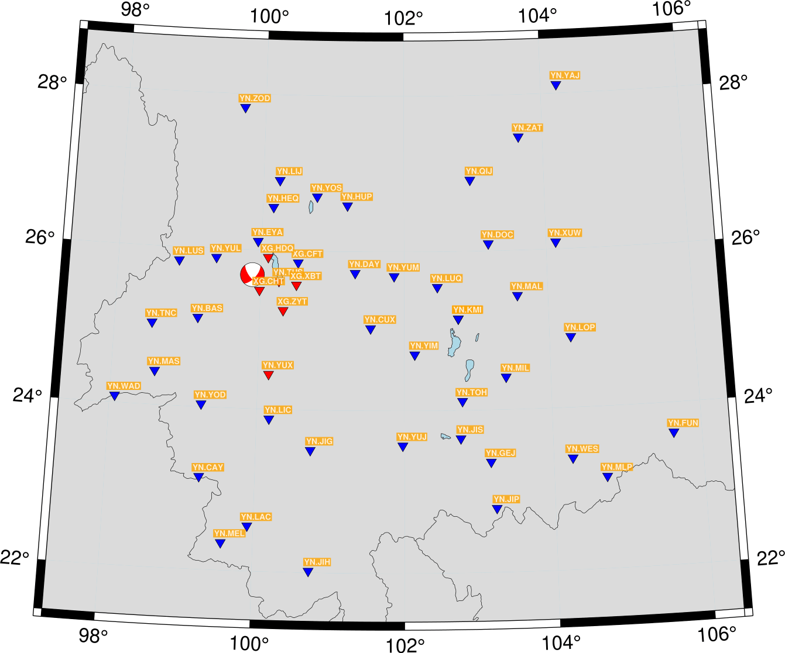
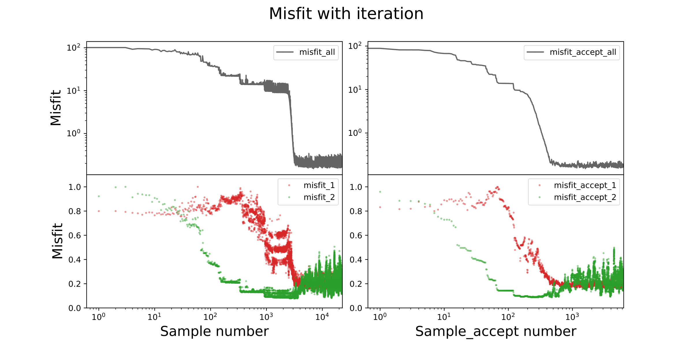
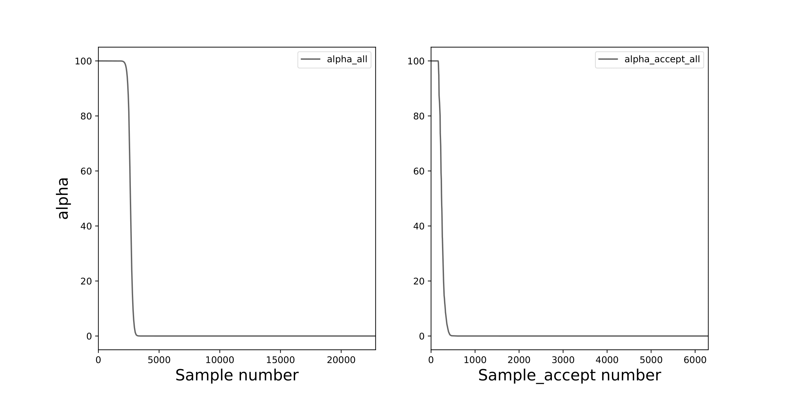
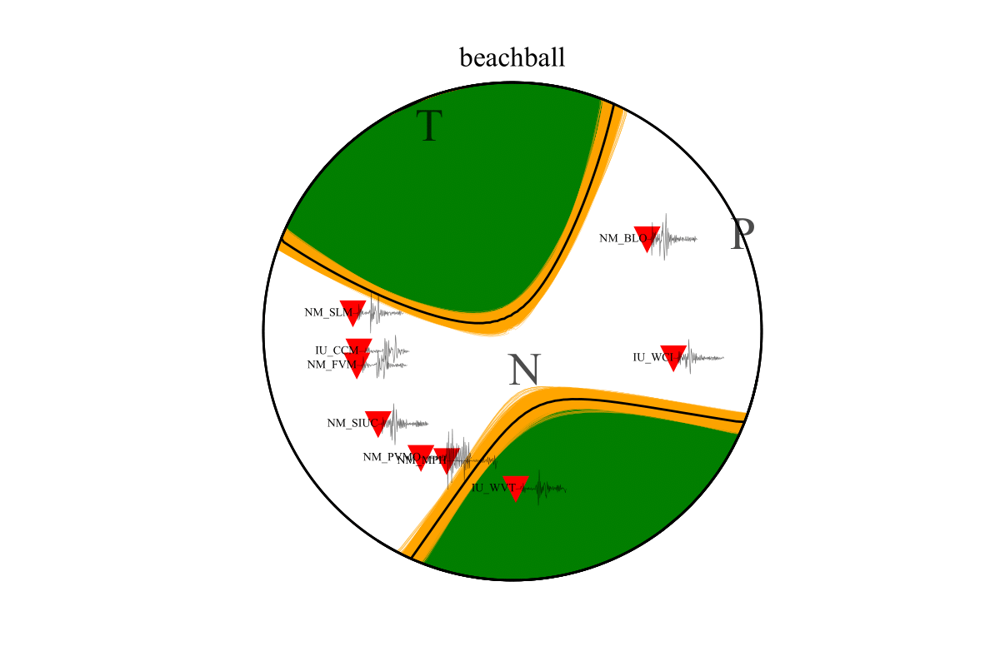

MCMTpy
======

About
-------------
🚨 **The package is still undergoing development.** 🚨

MCMTpy is a Python package designed for seismic source study. It provides functionality for focal mechanism 
inversion and source parameters analysis.

MCMTpy has mainly provided functions as:

* Focal mechanism inversion of the double couple source and moment tensor using improved **Markov chain Monte Carlo** method.
* A series of scripts is provided for source parameter calculation and conversion.
* Moment tensor decompose, Huston plot and Beachball with station projected.

and it has the features as:

* The package MCMTpy runs on Unix-like systems including Mac and Linux.
* It has a close integration with Obspy, pyfk and pyasdf.
* It can be done in parallel based on mpi4py.
* It's is efficient to do the seismological research based on python.

.. image:: ./docs/figures/logo/logo-small-cut.png
    :width: 80%
    :align: center

Documentation
-------------
Detailed `documentation <https://github.com/OUCyf/>`_ can be found here.

Citation
-------------
If you use **MCMTpy** for your research and prepare publications, please citing **MCMTpy**: 

* MCMTpy: A Python Package for Source Parameters Inversion Based on Cut-And-Paste Algorithm and Markov Chain Monte Carlo. 
  In prep for Seismological Research Letter.

Quick Installation
---------------------
Firstly, make sure **Anaconda** has been installed, then::

    $ conda create -n MCMTpy  python=3.8 numpy=1.16 matplotlib=3.1.1 mpi4py obspy pyasdf json5 tqdm
    $ conda activate MCMTpy
    $ pip install pyfk
    $ pip install MCMTpy

Some errors may occurred of that pyfk not support the new version of ``cysignals``, please::

    $ conda uninstall cysignals 
    $ pip install cysignals==1.10.2
    $ pip install pyfk
    

Successful installation will generate an executable program ``MCMTpy`` under the anaconda environment path: 
*/Users/user/opt/anaconda3/bin*. And run following code to check the installation::

    $ MCMTpy --help

Short Tutorial
-----------------
MCMTpy stores all the parameter information in four JSON files: **build_GFs.json**, **syn.json**, 
**sample.json** and **plot.json**, and you can find those json-files in path *./MCMTpy-master/jsons/*. 
For parameters choosing, please refer to **Detailed tutorial**. The steps to do inversion process are:

**1. Calculate green function database**::

    $ MCMTpy build_GFs pyfk  -c ./build_GFs.json
    $ mpirun -n 4 MCMTpy build_GFs pyfk  -c ./build_GFs.json        # parallel

**2. Synthesize the test data**::

    $ MCMTpy  syn pyfk  -c ./syn.json

**3. Inversion of focal mechanism**::
  
    $ MCMTpy  sample MH  -c ./sample.json
    $ mpirun -n 4  MCMTpy  sample MH  -c ./sample.json        # parallel

**4. Result visualization**::

    $ MCMTpy plot pyfk -c plot.json

.. image:: ./docs/figures/hist.png
    :width: 100%
    :align: center

.. image:: ./docs/figures/waveform.png
    :width: 100%
    :align: center

.. image:: ./docs/figures/Decompose.png
    :width: 100%
    :align: center

License
-------
MCMTpy is a free software: you can redistribute it and/or modify it under the terms of
the **MIT License**. A copy of this license is provided in
`LICENSE <https://github.com/OUCyf>`__.
