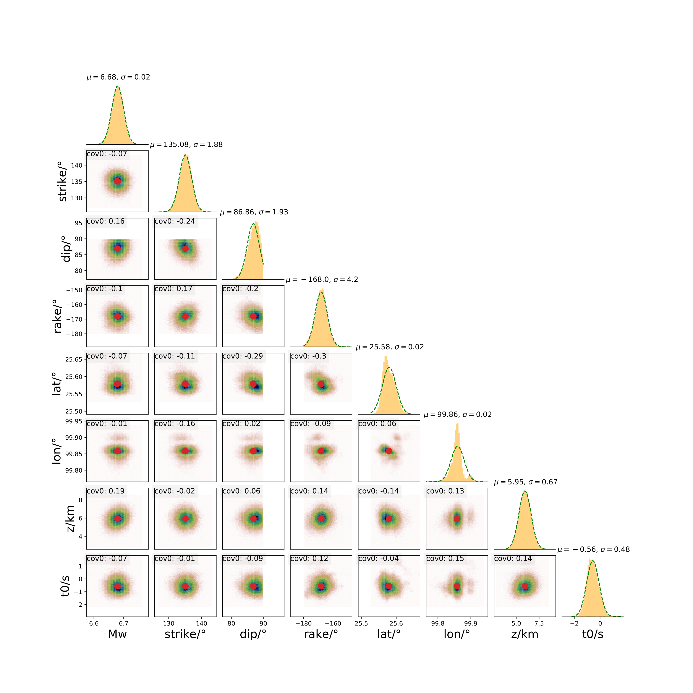

Result Visualization
======================

.. contents::
    :local:
    :depth: 1

* This is the plotting script of the MCMTpy, and all parameters are written into a JSON file named **plot.json**. 
  Some brief descriptions of the parameters are included here following the definination.   

* We do not recommend using relative paths because of the possibility of errors. **Absolute paths** are preferred.

Path
------------------------

``plot_output_path``,

* Plot result output file path.

``Inv_json_file``,

* The path to the Json-file used in inversion.

``fig_format``,

* Output figure format.

Hist
------------------------
``plot_hist``

* Whether to plot hist-figure.

``N_start``

* The sequence number of all-FM Markov chain to plot in hist-figure.

``N_start_accept``

* The sequence number of all-accept-FM Markov chain to plot in hist-figure.

``num_bins``

* Number of grids to draw in hist-figure.

``num_std``

* Range of axes in each subgraph (mean +- several times standard deviation). ``num_std`` means *n* times standard deviation.

``labels_name``

* Labels' name, it's depend on the number parameters that you want to inverse.
  
* eg: dc--> ['mw','strike/°','dip/°','rake/°','x/km','y/km','z/km','t0/s'].

* eg: mt--> ['Mw',  'Mxx',  'Myy',  'Mzz',  'Mxy',  'Mxz',  'Myz', 'x/km', 'y/km', 'z/km', 't0/s'].

Misfit
------------------------
``plot_misfit``

* Whether to plot misfit-figure.

``MPI_n_st``

* Which MPI's misfit do you want to draw in figure.

``Chains_n_st``

* Which Chains's misfit do you want to draw in figure.

.. note::
    We can only specify a chain of an MPI to draw misfit-figure.

Waveform
------------------------
``plot_waveform``

* Whether to plot waveform-figure.

``NET_STA``     

* The information contained in the two-dimensional list: [network_name]	[station_name]	[station_lat]	[source_lon]	[station_depth]

``FM_best``

* The best focal mechanism, it's a 1-d list.
* dc:[m0, str, dip rake, lat, lon, depth, t0] || mt:[m0, m_xx, m_xy, m_xz, m_yy, m_yz, m_zz, lat, lon, depth, t0] || ep:[m0]

``line_n_sta``

* Draw several stations per row in waveform-figure.

``max_p_ylim``

* The maximum amplitude of P wave drawing in waveform-figure.

``max_s_ylim``

* The maximum amplitude of S wave drawing in waveform-figure.

``max_surf_ylim``

* The maximum amplitude of Surf wave drawing in waveform-figure.

``plot_comp``

* Which components of the waveform that you want to plot in waveform-figure.
* The 2-d list represent the three components of P, S and Surf, respectively ZRT.

``plot_comp_name``

* Labels' name, it's depend on the number parameters that you want to plot with ``plot_comp``.

Example
----------------------------  
* The **example_path** need to de changed to your path, and run this notebook to set **sample_dc.json** file.

.. literalinclude:: S5_plot.py
  :language: python
  :linenos:

* Now you can run MCMTpy in bash::
  
  $ MCMTpy plot pyfk -c plot_dc_new.json

* Show hist in jupyter notebook::

    fig_hist = os.path.join(plot_dc_json["plot_output_path"],'hist.jpg')
    Image(filename = fig_hist, width=600)

* Show hist_accept in jupyter notebook::
  
    fig_hist_accept = os.path.join(plot_dc_json["plot_output_path"],'hist_accept.jpg')
    Image(filename = fig_hist_accept, width=600)

* Show misfit in jupyter notebook::
  
    fig_misfit = os.path.join(plot_dc_json["plot_output_path"],'misfit.jpg')
    Image(filename = fig_misfit, width=600)

.. image:: ../../figures/misfit.png
    :width: 100%
    :align: center

* Show waveform in jupyter notebook::
  
    fig_waveform = os.path.join(plot_dc_json["plot_output_path"],'waveform.jpg')
    Image(filename = fig_waveform, width=1000)

.. image:: ../../figures/waveform.png
    :width: 100%
    :align: center

.. note::
    Please follow the above parameter instructions and set all parameters correctly before running the program.
    Otherwise, it is easy to report an error!